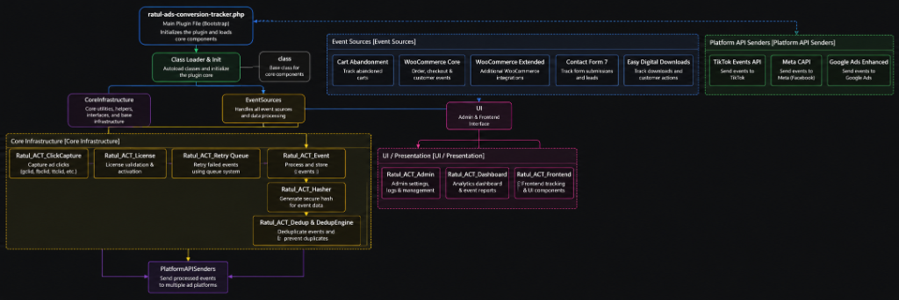

# Technical Architecture Guide (Ratul-ACT)

This document provides a detailed breakdown of the codebase architecture, data flows, and security protocols built into **Ratul Ads Conversion Tracker**.

---

## 🗺️ System Architecture Overview

The following diagram illustrates how the plugin hooks into WooCommerce, captures client-side events, persists tracking keys, and dispatches server-side events asynchronously to Meta, TikTok, and Google Ads:



---

## 📁 Codebase Directory Structure

* **`ratul-ads-conversion-tracker.php`**: The main bootstrap file that initiates the autoloader and boots core modules.
* **`includes/`**: Core infrastructure modules:
  * `class-ratul-act-cookiehelper.php`: Generates first-party `Set-Cookie` headers for click IDs.
  * `class-ratul-act-enrichment.php`: Handles user IP, User-Agent, and geolocation enrichment.
  * `class-ratul-act-identity.php`: Manages customer IDs and external stitching parameters.
  * `class-ratul-act-dedup.php` & `class-ratul-act-pixel-dedup.php`: Handles Event ID correlation.
  * `class-ratul-act-retry.php`: Manages the database-backed asynchronous retry queue.
  * `class-ratul-act-logger.php`: Logs event performance statistics to a custom database table.
* **`platforms/`**: Platform API Integration adapters:
  * `class-ratul-act-meta.php`: Sends Conversions API payloads to Graph endpoints.
  * `class-ratul-act-tiktok.php`: Connects with the TikTok Events API.
  * `class-ratul-act-google.php`: Implements Google Ads Enhanced Conversions.
* **`sources/`**: E-commerce event sources:
  * `class-ratul-act-woocommerce.php` & `class-ratul-act-source-woocommerce.php`: WooCommerce checkout lifecycle events.
  * `class-ratul-act-subscriptions.php`: Hook adapters for WooCommerce Subscriptions.
  * `class-ratul-act-cart-abandonment.php`: Cron-backed Cart abandonment triggers.
* **`frontend/`**: Injected client-side script (`ratul-act-pixel.js`) that captures ad clicks and triggers frontend tags.

---

## 🔄 Core Processing Workflows

### 1. The Cookie Bypass Engine (ITP Mitigation)
To bypass browser restrictions that cap JavaScript-written cookies (like `_fbc` or `_gcl_aw`) to 7 days, Ratul-ACT utilizes a PHP-based cookie helper:
1. When a user lands on the site with click parameters (`?fbclid=...` or `?gclid=...`), the PHP engine captures them immediately.
2. It sends a `Set-Cookie` response header with `HttpOnly` and `Secure` attributes.
3. This sets a first-party cookie on the server level, extending the lifetime of these identifiers to **2 years**.

### 2. Synchronized Event Deduplication
To ensure Meta doesn't double-count events that fire on both the browser (pixel) and server (CAPI), both triggers must match exactly:
1. When a page loads, the plugin generates a unique page load seed.
2. The browser pixel fires a tag containing the `eventID`:
   ```javascript
   fbq('track', 'AddToCart', params, { eventID: 'atc_abc123' });
   ```
3. Simultaneously, the browser sends a beacon to `/wp-json/ratul-ads-conversion-tracker/v1/custom-event` containing the same event ID.
4. The server receives this payload and sends it via CAPI with the exact same `eventID` (`atc_abc123`). Meta matches the IDs and merges the events.

### 3. Asynchronous Queue & Exponential Back-Off
If a platform API fails (due to rate-limiting or network issues), the plugin uses a resilient queue system:
1. Failed events are stored in the database (`wp_ratul_act_retry_queue`).
2. A background cron job checks this queue every 15 minutes.
3. The queue retries sending the payload using an exponential back-off multiplier up to a maximum of 5 retries before failing.
