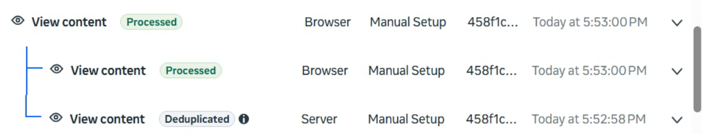
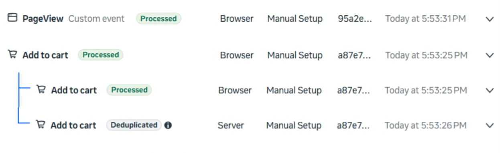
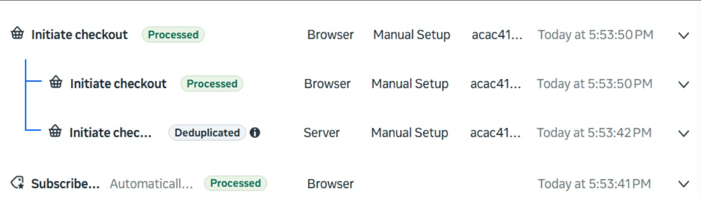
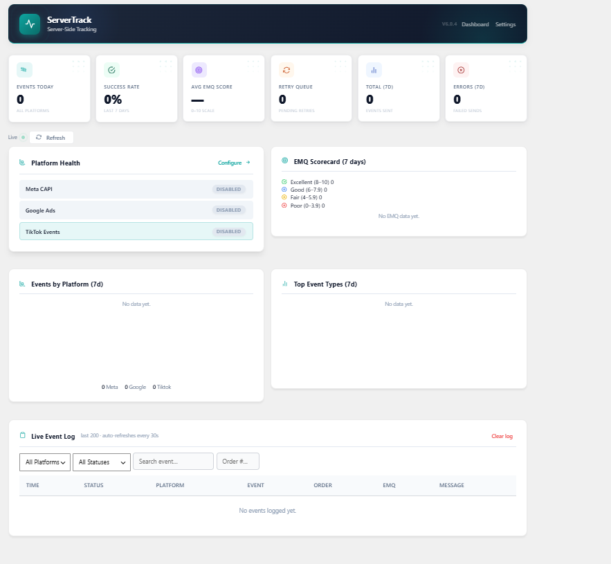
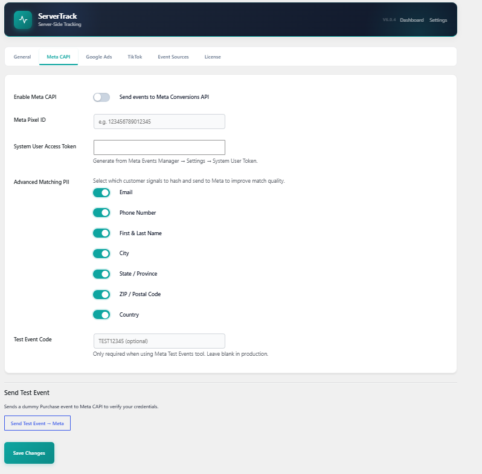
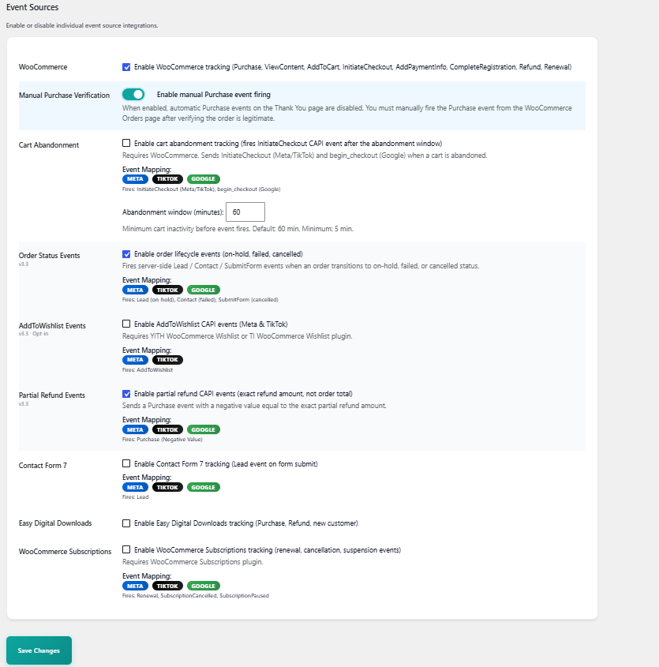

# Ratul Ads Conversion Tracker

<p align="center">
  
  
  
  
</p>

<p align="center">
  
  
  
</p>

---

**Ratul Ads Conversion Tracker** is a professional, high-performance server-side Conversion API (CAPI) tracking plugin for WordPress and WooCommerce. It routes client-side events through your own first-party domain, stitches browser identity parameters, and dispatches them synchronously to Meta (Facebook), TikTok, and Google Ads with perfect event deduplication and GDPR/CCPA consent compliance.

## Why Ratul Ads Conversion Tracker?

Instead of paying high monthly fees for third-party server-side Tag Manager containers (e.g., Stape.io or Google Cloud GTM), Ratul Ads Conversion Tracker acts as your own **self-hosted First-Party CAPI Gateway** directly inside WordPress. 

- **Defeats Safari ITP:** Generates first-party `Set-Cookie` headers via PHP, extending ad-click identifier Lifespans (`fbclid`, `gclid`) from the JavaScript-capped 7 days to a full **2 years**.
- **Ad-blocker Resiliency:** Bypasses browser-level trackers entirely by proxying events through a local REST endpoint (`/wp-json/ratul-ads-conversion-tracker/v1/pixel`).
- **Deep Identity Stitching:** Bundles MaxMind GeoIP resolution, true client IP detection across Cloudflare/Sucuri, and user-agent parsing to maximize your Meta Event Match Quality (EMQ).

---

## Meta Event Manager Deduplication in Action

Ratuls-ACT aligns event ID generation seeds between the browser and the server. Below is the live verification in the Meta Event Manager, demonstrating perfect 1-to-1 event deduplication:

### 1. ViewContent Event Deduplication
Both the browser and server triggers report the exact same event ID, allowing Meta to merge them into a single processed conversion.


### 2. Add to Cart Event Deduplication
Standard and AJAX-based Add to Cart triggers map directly to the same event ID, eliminating double counting.


### 3. Initiate Checkout Event Deduplication
Deduplicates Checkout visits safely by passing the enqueued event ID between the WooCommerce session and server CAPI.


---

## Plugin Dashboard & Configuration Admin UI

Ratuls-ACT features a premium, intuitive admin dashboard and a granular settings console to configure multi-pixel events, tracking sources, and manual approvals.

### 1. Real-Time Analytics Dashboard
Directly inspect diagnostic performance, health, API logs, and events dispatch status in real-time.


### 2. Meta Pixel & CAPI Settings
Loop and fire events to multiple Meta Properties concurrently with advanced matching parameter configurations.


### 3. Event Sources & Verification Settings
Fine-tune tracking sources (WooCommerce, Cart Abandonment, Subscriptions) and toggle Manual Purchase Verification.


---

## Core Architecture

Ratuls-ACT is organized into modular, clean layers:

```text
ratul-ads-conversion-tracker.php                       ← Bootstrap loader
│
├── includes/
│   ├── class-ratul-ads-conversion-tracker-cookiehelper.php   1st-Party Cookie Generator (ITP bypass)
│   ├── class-ratul-ads-conversion-tracker-dispatcher.php       Secure Cryptotoken-based Async loopback
│   ├── class-ratul-ads-conversion-tracker-pixel-dedup.php    Checkout and Cart Button ID handlers
│   ├── class-ratul-ads-conversion-tracker-enrichment.php     IP, Geo, and UA Signal enrichment
│   ├── class-ratul-ads-conversion-tracker-health.php         Daily API token health diagnostic cron
│   ├── class-ratul-ads-conversion-tracker-stream.php         Real-time SSE Debug Console
│   ├── class-ratul-ads-conversion-tracker-attribution.php    10-touch UTM History Tracker
│   ├── class-ratul-ads-conversion-tracker-consent.php        GDPR Consent State manager
│   ├── class-ratul-ads-conversion-tracker-event.php          Event DTO Model
│   ├── class-ratul-ads-conversion-tracker-retry.php          Exponential back-off retry queue
│   └── class-ratul-ads-conversion-tracker-logger.php         Structured SQL event logger
│
├── platforms/
│   ├── class-ratul-ads-conversion-tracker-meta.php           Meta Graph API (Multi-pixel arrays)
│   ├── class-ratul-ads-conversion-tracker-tiktok.php         TikTok Events API v2
│   └── class-ratul-ads-conversion-tracker-google.php         Google Ads Enhanced Conversions
│
├── sources/
│   ├── class-ratul-ads-conversion-tracker-woocommerce.php          Core WooCommerce Hooks
│   ├── class-ratul-ads-conversion-tracker-source-woocommerce.php   Extended Lifecycle Hooks (Wishlist/Status)
│   ├── class-ratul-ads-conversion-tracker-subscriptions.php        WooCommerce Subscriptions integration
│   ├── class-ratul-ads-conversion-tracker-cart-abandonment.php     Cart Abandonment CAPI cron
│   └── ...
│
├── frontend/
│   └── class-ratul-ads-conversion-tracker-frontend.php       Browser JS localization bridge
│
└── admin/
    ├── class-ratul-ads-conversion-tracker-dashboard.php      Real-time Dashboard UI & Charts
    └── class-ratul-ads-conversion-tracker-admin.php          Admin Settings & Manual Approval Column
```

---

## Advanced Verification Panel

For high-ticket or fraud-sensitive stores, enable **Manual Purchase Verification** in settings:
- Disables automatic purchase event firing on checkout.
- Adds an **Approve & Sync** / **Mark Fraud** control column directly in the WooCommerce Orders list.
- Admin can manually verify the purchase before releasing the conversion data to Meta.

---

## Installation & Setup

1. Upload the `ratul-ads-conversion-tracker` directory to your WordPress `/wp-content/plugins/` directory.
2. Activate the plugin via **Plugins → Installed Plugins** in the WordPress Dashboard.
3. Configure your API tokens under **Ratuls-ACT → Settings**.
4. Check real-time API logs and matching scores under the **Ratuls-ACT → Dashboard** tab.

## Custom Events (REST API Proxy)

Fire custom server events client-side securely through the local proxy endpoint:

```javascript
fetch('/wp-json/ratul-ads-conversion-tracker/v1/pixel/meta', {
  method: 'POST',
  headers: { 'Content-Type': 'application/json' },
  body: JSON.stringify({
    event_name: 'Lead',
    params: {
      value: 49.99,
      currency: 'USD',
      content_name: 'Newsletter signup'
    }
  })
});
```

---

## License

GPL-2.0-or-later · © MD. Yaser Ahmmed Ratul

