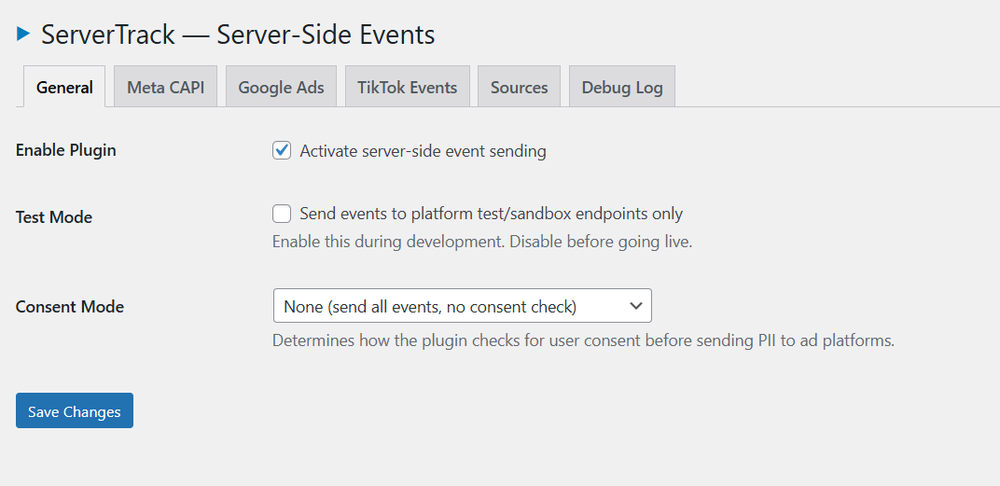
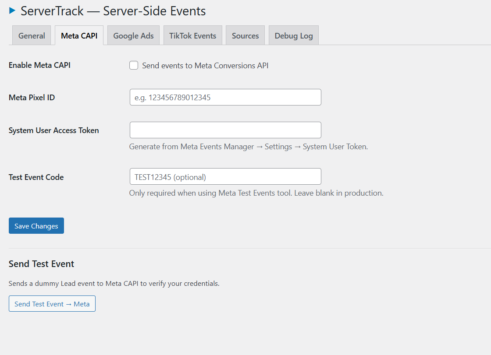
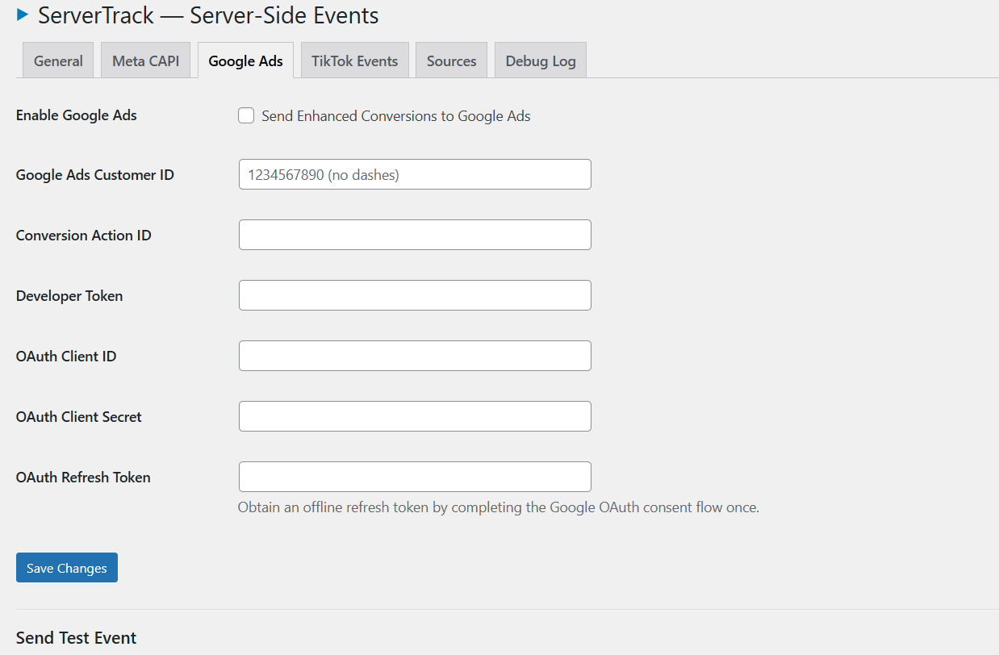
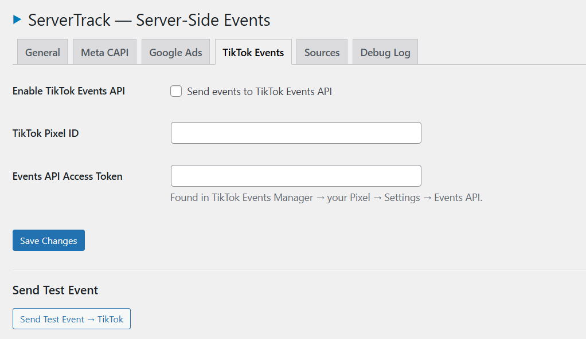
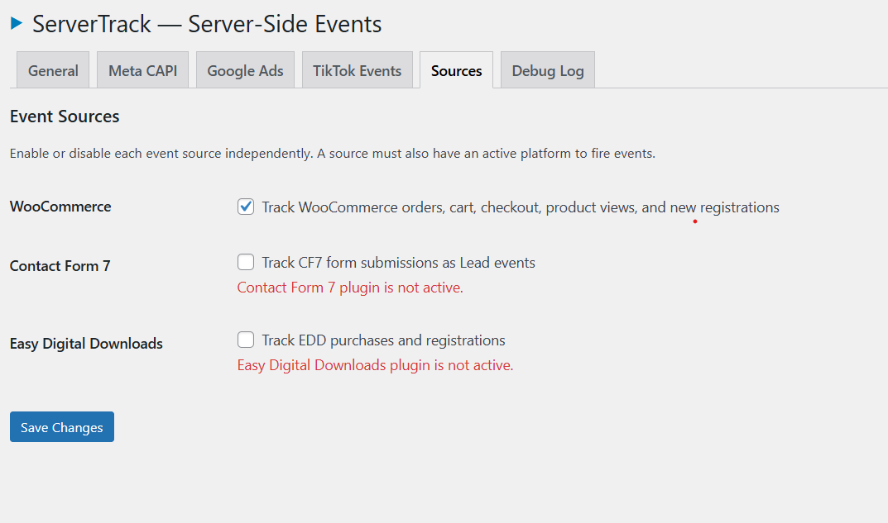
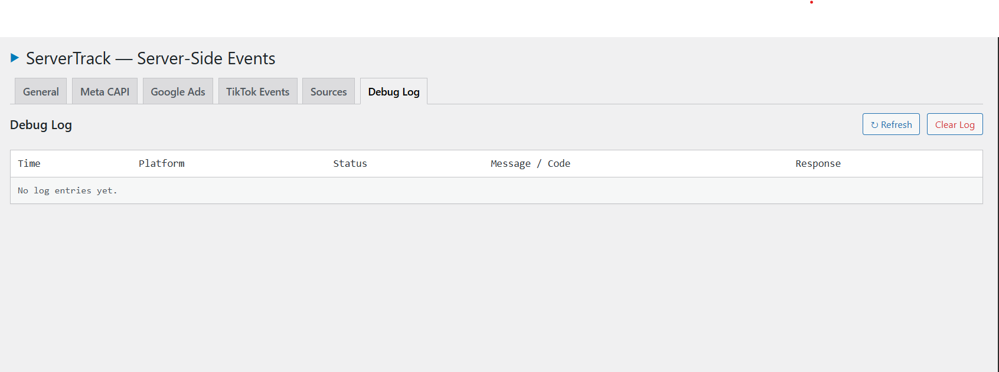

# 🚀 ServerTrack Native

**A high-performance, zero-dependency server-side tracking plugin for WordPress.**

ServerTrack completely bypasses browser ad blockers and iOS privacy restrictions (ITP) by moving conversion tracking to your server backend. 

[Features](#-key-features) • [Supported Platforms](#-supported-integrations) • [Screenshots](#-gallery) • [Installation](#-installation)

---

## 📸 Gallery

  
  

  
  

  
  

---

## ✨ Key Features

*   **⚡ Zero Dependencies:** Built strictly with core PHP and native WordPress APIs. No Composer, no NPM, no bloated vendor folders.
*   **🛡️ 100% Server-Side:** Sends events securely and directly to platform APIs (Meta Conversions API, Google Ads Enhanced Conversions, TikTok Events API).
*   **⏱️ Async Processing:** Checkout performance is fully protected. All purchase events are offloaded to WP-Cron and executed asynchronously in the background.
*   **🔗 Robust Deduplication:** An intelligent locking mechanism ensures events are never sent twice, safely syncing server-generated `event_id`s with the browser pixel.
*   **🎨 Native UI:** The admin dashboard perfectly inherits your WordPress theme colors, loading instantly without external CSS frameworks.
*   **🔒 GDPR/CCPA Compliant:** Includes native consent mode (`granted` vs `denied`) and strictly hashes all Personally Identifiable Information (PII) using SHA-256 before transmission.

---

## 🔌 Supported Integrations

### 🎯 Ad Platforms
*   **Meta (Facebook) Conversions API**
*   **Google Ads (Enhanced Conversions)**
*   **TikTok Events API**

### 🛒 Event Sources
*   **WooCommerce:** Tracks `Purchase`, `ViewContent`, `AddToCart`, `InitiateCheckout`, and `Lead` (Account Registration). Intelligently handles refunds and subscription renewals.
*   **Contact Form 7:** Tracks form submissions as `Lead` events. Includes a visual mapper to link your exact CF7 tags (like `[your-email]`) to tracking parameters.
*   **Easy Digital Downloads:** Tracks `Purchase` and `Lead` (Registration) events.

---

## 🚀 Installation

1.  Download the repository as a ZIP or clone the `servertrack` folder.
2.  Upload it to your `/wp-content/plugins/` directory.
3.  Activate the plugin through the **Plugins** menu in WordPress.
4.  Navigate to **Settings → ServerTrack** to configure your API keys.

---

## ⚙️ Configuration Guide

### 1. Enable Event Sources
Go to the **Sources** tab and enable WooCommerce, CF7, or EDD based on your site's technology stack.

### 2. Configure Platforms
*   **Meta:** Enter your Pixel ID and System User Access Token.
*   **Google:** Enter your Customer ID, Conversion ID, Developer Token, and OAuth credentials. ServerTrack automatically handles token refreshes.
*   **TikTok:** Enter your Pixel ID and Access Token.

### 3. Verify in Debug Log
Open the **Debug Log** tab to see real-time HTTP responses from the platforms. It retains the last 50 events so you can instantly verify success codes (`200 OK`) or diagnose configuration errors.

---

## 🏗️ Architecture constraints

ServerTrack enforces strict, professional architectural constraints to guarantee stability and security:
*   `wp_remote_post()` is used exclusively for all API calls (no raw cURL).
*   All data is strictly validated (`sanitize_text_field`, `absint`) and securely escaped.
*   Event models are structured using a unified Data Transfer Object (`ServerTrack_Event`).
*   No external asset loading on the frontend; the minimal browser pixel is injected inline and localized via `wp_localize_script`.

---

## 📜 License
GPLv2 or later

## 👨‍💻 Credits
**Developed by:** Yaser Ahmmed Ratul  
**Portfolio:** [yaratul.com](https://yaratul.com)  
**Location:** Dhaka, Bangladesh
